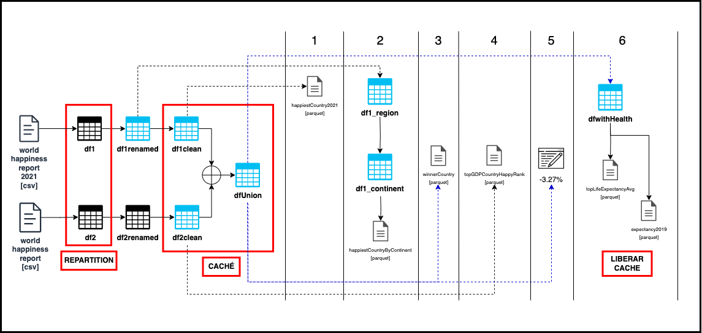

# proyecto-final-grupo3

**Resuelto por:** Jiashu Liu, Daniel González Rey y Gabriela Torres
\
\
Resolución del proyecto final de la **formación de Spark/Scala** que consiste en responder a una serie de preguntas sobre datos contenidos en dos ficheros csv. 

Se ha realizado una resolución en Scala en primera instancia y posteriormente traducido al lenguaje de PySpark:
* Proyecto_Final_scala_spark.scala
* Proyecto_Final_python_spark.py

### Esquema general del procesamiento de los DataFrame para responder a las preguntas: 
(Válido tanto en Scala como en Python)

